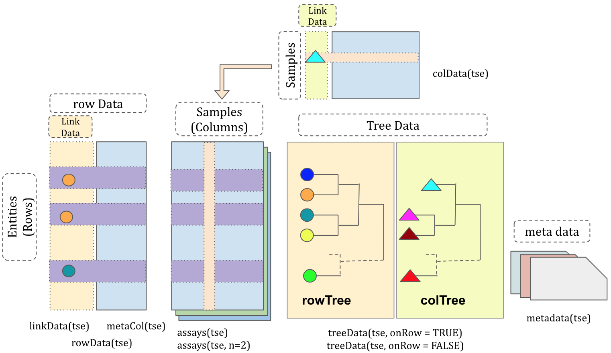

```{r setup, include=FALSE}
knitr::opts_chunk$set(echo = TRUE, message = FALSE, warning = FALSE)
```

# Introduction 

The `MicrobiomeExperiment` class is an extension of the
`TreeSummarizedExperiment` and `SingleCellExperiment` class [@LunA2020]. In
additon to the tree structures introduced by `TreeSummarizedExperiment`,
`MicrobiomeExperiment` adds a `referenceSeq` slot aligned with row data for
storing reference sequences. These are frequently used in microbiome or
metabolomic studies serving as reference for taxonomic or functional annotation
of assay data detected.

# MicrobiomeExperiment {#me-class}

## Anatomy of MicrobiomeExperiment

```{r strTSE, echo=FALSE, fig.cap= "The structure of the MicrobiomeExperiment class."}

```

Compared to the `TreeSummarizedExperiment` objects, `MicrobiomeExperiment` has
one additional slot, `referenceSeq`. This slot can either hold no data (`NULL`),
a `DNAStringSet` of the same length as `rowData` or a `DNAStringSetList` with
each element of the same length as `rowData`.

## Example data


```{r, message=FALSE}
library(TreeSummarizedExperiment)
```

```{r, include=FALSE}
# assays data (typically, representing observed data from an experiment)
assay_data <- rbind(rep(0, 4), matrix(1:20, nrow = 5))
colnames(assay_data) <- paste0("sample", 1:4)
rownames(assay_data) <- paste("entity", seq_len(6), sep = "")
assay_data

# row data (feature annotations)
row_data <- data.frame(Kingdom = "A",
                       Phylum = rep(c("B1", "B2"), c(2, 4)),
                       Class = rep(c("C1", "C2", "C3"), each = 2),
                       OTU = paste0("D", 1:6),
                       row.names = rownames(assay_data),
                       stringsAsFactors = FALSE)

row_data
# column data (sample annotations)
col_data <- data.frame(gg = c(1, 2, 3, 3),
                       group = rep(LETTERS[1:2], each = 2), 
                       row.names = colnames(assay_data),
                       stringsAsFactors = FALSE)
col_data

library(ape)

# The first toy tree 
set.seed(12)
row_tree <- rtree(5)

# The second toy tree 
set.seed(12)
col_tree <- rtree(4)

# change node labels
col_tree$tip.label <- colnames(assay_data)
col_tree$node.label <- c("All", "GroupA", "GroupB")

tip_lab <- row_tree$tip.label
row_lab <- tip_lab[c(1, 1:5)]
```

```{r}
assay_data
row_data
col_data
row_tree
row_lab
col_tree
```

Based on the example data from the `TreeSummarizedExperiment` vignette we add
sequence data...

```{r}
refSeq <- DNAStringSet(rep("AGCT", nrow(row_data)))
```

... and construct a `MicrobiomeExperiment`.

```{r}
me <- MicrobiomeExperiment(assays = list(Count = assay_data),
                           rowData = row_data,
                           colData = col_data,
                           rowTree = row_tree,
                           rowNodeLab = row_lab,
                           colTree = col_tree,
                           referenceSeq = refSeq)
me
```

The reference sequences can also be set after object creation and retrieved
using an accessor function of the same name.

```{r}
referenceSeq(me) <- refSeq
referenceSeq(me)
```

# Session Info

```{r}
sessionInfo()
```

# References
