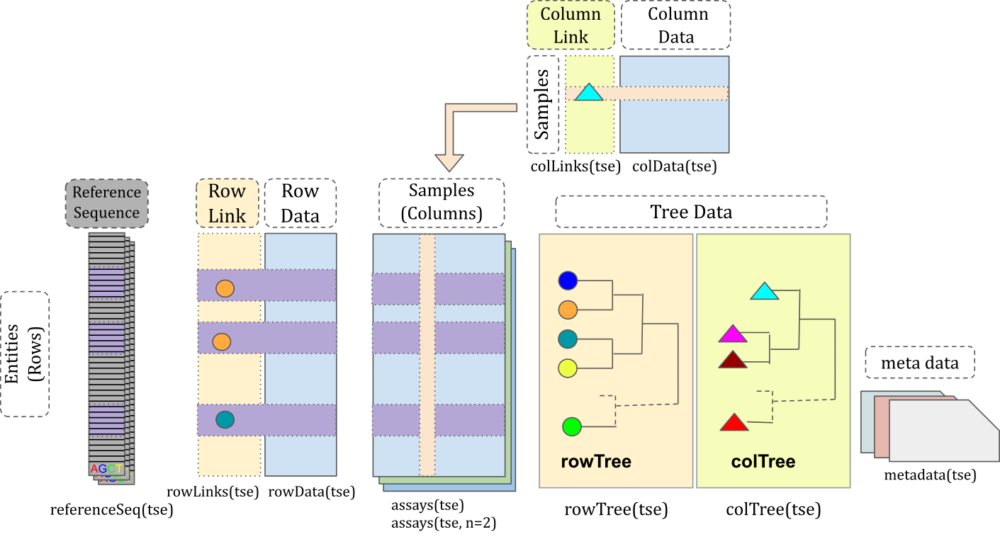

```{r setup, include=FALSE}
knitr::opts_chunk$set(echo = TRUE, message = FALSE, warning = FALSE)
```


# Introduction 

The `TreeSummarizedExperiment` class is an extension of the
`SingleCellExperiment` class [@LunA2020]. It's used to store rectangular data
of experimental results as in a `SingleCellExperiment`, and also supports the
storage of a hierarchical structure and its link information to the rectangular
data.

# TreeSummarizedExperiment {#tse-class}

## Anatomy of TreeSummarizedExperiment

```{r strTSE, echo=FALSE, fig.cap= "The structure of the TreeSummarizedExperiment class."}

```
Compared to the `SingleCellExperiment` objects, `TreeSummarizedExperiment` has
four additional slots:
    
* `rowTree`: the hierarchical structure on the rows of the `assays`.
* `rowLinks`: the link information between rows of the `assays` and the `rowTree`.
* `colTree`: the hierarchical structure on the columns of the `assays`.
* `colLinks`: the link information between columns of the `assays` and the
`colTree`.

The `rowTree` and$/$or `colTree` can be left empty (`NULL`) if no trees are available; in this case, the `rowLinks` and$/$or `colLinks` are also set to `NULL`. All other `TreeSummarizedExperiment` slots are inherited from `SingleCellExperiment`.

The `rowTree` and `colTree` slots require the tree to be an object of the `phylo`
class. If a tree is available in an alternative format, it can often be converted to a `phylo` object using dedicated R packages (e.g., `r Biocpkg("treeio")` [@Wang2019]).

Functions in the `r Biocpkg("TreeSummarizedExperiment")` package fall in two main categories: operations on the `TreeSummarizedExperiment` object or operations on the tree (`phylo`) objects. The former includes constructors and accessors, and the latter serves as "pieces" to be assembled as accessors or functions that manipulate the `TreeSummarizedExperiment` object. Given that more than 200 R packages make use of the `phylo` class, there are many resources (e.g., `r CRANpkg("ape")`) for users to manipulate the small "pieces" in addition to those provided in `r Biocpkg("TreeSummarizedExperiment")`.      

## Toy data

We generate a toy dataset that has observations of 6 entities collected from 4 samples as an example to show how to construct a `TreeSummarizedExperiment` object.

```{r}
library(TreeSummarizedExperiment)

# assays data (typically, representing observed data from an experiment)
assay_data <- rbind(rep(0, 4), matrix(1:20, nrow = 5))
colnames(assay_data) <- paste0("sample", 1:4)
rownames(assay_data) <- paste("entity", seq_len(6), sep = "")
assay_data
```

The information of entities and samples are given in the **row_data** and **col_data**, respectively.
```{r}
# row data (feature annotations)
row_data <- data.frame(Kingdom = "A",
                       Phylum = rep(c("B1", "B2"), c(2, 4)),
                       Class = rep(c("C1", "C2", "C3"), each = 2),
                       OTU = paste0("D", 1:6),
                       row.names = rownames(assay_data),
                       stringsAsFactors = FALSE)

row_data
# column data (sample annotations)
col_data <- data.frame(gg = c(1, 2, 3, 3),
                       group = rep(LETTERS[1:2], each = 2), 
                       row.names = colnames(assay_data),
                       stringsAsFactors = FALSE)
col_data
```

The hierarchical structure of the `r nrow(assay_data)` entities and 
`r ncol(assay_data)` samples are denoted as **row_tree** and **col_tree**,
respectively. The two trees are `phylo` objects randomly created with `rtree`
from the package `r CRANpkg("ape")`. Note that the row tree has 5 rather than 6
leaves; this is used later to show that multiple rows in the `assays` are allowed to map to a single node in the tree.

```{r}
library(ape)

# The first toy tree 
set.seed(12)
row_tree <- rtree(5)

# The second toy tree 
set.seed(12)
col_tree <- rtree(4)

# change node labels
col_tree$tip.label <- colnames(assay_data)
col_tree$node.label <- c("All", "GroupA", "GroupB")
```

We visualize the tree using the package `r Biocpkg("ggtree")` [@Yu2017].  Here, the
internal nodes of the **row_tree** have no labels as shown in Figure \@ref(fig:plot-rtree).

```{r plot-rtree, fig.cap="\\label{plot-rtree} The structure of the row tree. The node labels and the node numbers are in orange and blue text, respectively.", out.width="90%"}
library(ggtree)
library(ggplot2)

# Visualize the row tree
ggtree(row_tree, size = 2, branch.length = "none") +
    geom_text2(aes(label = node), color = "darkblue",
               hjust = -0.5, vjust = 0.7, size = 5.5) +
    geom_text2(aes(label = label), color = "darkorange",
               hjust = -0.1, vjust = -0.7, size = 5.5) 
```


The **col_tree** has labels for internal nodes.
```{r plot-ctree, fig.cap="\\label{plot-ctree} The structure of the column tree. The node labels and the node numbers are in orange and blue text, respectively.", out.width="90%"}
# Visualize the column tree
ggtree(col_tree, size = 2, branch.length = "none") +
    geom_text2(aes(label = node), color = "darkblue",
               hjust = -0.5, vjust = 0.7, size = 5.5) +
    geom_text2(aes(label = label), color = "darkorange",
               hjust = -0.1, vjust = -0.7, size = 5.5)+
    ylim(c(0.8, 4.5)) +
    xlim(c(0, 2.2))
```

## The construction of `TreeSummarizedExperiment`

The `TreeSummarizedExperiment` class is used to store the toy data generated in the previous section:
    **assay_data**, **row_data**, **col_data**, **col_tree** and **row_tree**. To
correctly store data, the link information between the rows (or columns) of
**assay_data** and the nodes of the **row_tree** (or **col_tree**) can be provided via a character vector `rowNodeLab` (or `colNodeLab`), with length equal to the number of rows (or columns) of the `assays`; otherwise the row (or column) names are used. Those columns
or rows with labels that are not present among the node labels of the tree are removed with
warnings. The link data between the `assays` tables and the tree data is
automatically generated in the construction.

The row and column trees can be included simultaneously in the construction.
Here, the column names of **assay_data** can be found in the node labels of the
column tree, which enables the link to be created between the column dimension
of **assay_data** and the column tree **col_tree**. If the row names of
**assay_data** are not in the node labels of **row_tree**, we would need to
provide their corresponding node labels (**row_lab**) to `rowNodeLab` in the
construction of the object. It is allowed to have multiple rows or/and columns
mapped to a node, for example, the same leaf label is used for the first two
rows in **row_lab**.

```{r}
# all column names could be found in the node labels of the column tree
all(colnames(assay_data) %in% c(col_tree$tip.label, col_tree$node.label))

# provide the node labels in rowNodeLab
tip_lab <- row_tree$tip.label
row_lab <- tip_lab[c(1, 1:5)]
row_lab

both_tse <- TreeSummarizedExperiment(assays = list(Count = assay_data),
                                     rowData = row_data,
                                     colData = col_data,
                                     rowTree = row_tree,
                                     rowNodeLab = row_lab,
                                     colTree = col_tree)
```


```{r}
both_tse
```
When printing out **both_tse**, we see a similar message as
`SingleCellExperiment` with four additional lines for `rowLinks`, `rowTree`,
`colLinks` and `colTree`. 

## The accessor functions
### Assays, rowData, colData, and metadata

For slots inherited from the `SingleCellExperiment` class, the accessors are
exactly the same as shown in `r Biocpkg("SingleCellExperiment")`.

```{r}
# to get the first table in the assays
(count <- assays(both_tse)[[1]])
```

```{r}
# to get row data
rowData(both_tse)
```

```{r}
# to get column data
colData(both_tse)
```

```{r}
# to get metadata: it's empty here
metadata(both_tse)
```

### rowLinks, colLinks {#linkData}

For new slots, we provide `rowTree` (and `colTree`) accessors to retrieve the row (column) trees, and `rowLinks` (and `colLinks`) to retrieve the link information between `assays` and nodes of the row (column) tree. If the tree is not available, the corresponding link data is `NULL`. 

```{r}
# access trees
rowTree(both_tse)
colTree(both_tse)
```

```{r}
# access the link data
(r_link <- rowLinks(both_tse))
(c_link <- colLinks(both_tse))
```

The link data objects are of the `LinkDataFrame` class, which extends the `DataFrame` class with the restriction that it has at least four columns:
    
* `nodeLab`: the labels of nodes on the tree
* `nodeLab_alias`: the alias labels of nodes on the tree
* `nodeNum`: the numbers of nodes on the tree
* `isLeaf`: whether the node is a leaf node

More details about
the `DataFrame` class could be found in the `r Biocpkg("S4Vectors")` R/Bioconductor package.

```{r}
class(r_link)
showClass("LinkDataFrame")
```

The link data is automatically generated when constructing the
`TreeSummarizedExperiment` object. We highly recommend users not to modify it
manually; otherwise the link might be broken. For R packages developers, we show
in the Section \@ref(modifyLink) about how to update the link.

### Reference sequence data

In addition to tree data, reference sequence data can be stored per feature in 
a `TreeSummarizedExperiment` object.

```{r}
refSeq <- DNAStringSet(rep("AGCT", nrow(both_tse)))
```

The data must match the number of rows in the object and can either be added to
the object upon creation or later on with the accessor function `referenceSeq`.

```{r}
referenceSeq(both_tse) <- refSeq
referenceSeq(both_tse)
```

Both `DNAStringSet` or `DNAStringSetList` can be used, so that a single or 
multiple sequences can be stored per feature.

## The subseting function

A `TreeSummarizedExperiment` object can be subset in two different ways: `[` to
subset by rows or columns, and `subsetByNode` to subset by nodes of a tree. To
keep track of the original data, the `rowTree` and `colTree` stay the same after subsetting, while `rowLinks` and `rowData` are updated accordingly.

```{r}
sub_tse <- both_tse[1:2, 1]
sub_tse
```


```{r}
# the row data
rowData(sub_tse)

# the row link data
rowLinks(sub_tse)

```

```{r}
# The first four columns are from colLinks data and the others from colData
cbind(colLinks(sub_tse), colData(sub_tse))
```

To subset by nodes, we specify the node by its node label or node number. Here, *entity1* and *entity2* are both mapped to the same node `t3`, so both of them are retained.

```{r}
node_tse <- subsetByNode(x = both_tse, rowNode = "t3")

rowLinks(node_tse)
```

Subsetting simultaneously in both dimensions is also allowed.

```{r}
node_tse <- subsetByNode(x = both_tse, rowNode = "t3", 
                         colNode = c("sample1", "sample2"))
assays(node_tse)[[1]]
```


## Changing the tree

The current tree can be replaced by a new one using `changeTree`. If the hierarchical information is available as a `data.frame` with each column representing a taxonomic level (e.g., *row_data*), we provide `toTree` to convert it into a `phylo` object. 

```{r plot-taxa2phylo, fig.cap="\\label{plot-taxa2phylo} The structure of the taxonomic tree that is generated from the taxonomic table.", out.width="90%"}
# The toy taxonomic table
(taxa <- rowData(both_tse))

# convert it to a phylo tree
taxa_tree <- toTree(data = taxa)

# Viz the new tree
ggtree(taxa_tree)+
    geom_text2(aes(label = node), color = "darkblue",
               hjust = -0.5, vjust = 0.7, size = 5.5) +
    geom_text2(aes(label = label), color = "darkorange",
               hjust = -0.1, vjust = -0.7, size = 5.5) +
    geom_point2()
```

A mapping to match nodes of the two trees is required if nodes are labeled differently. 
```{r}
taxa_tse <- changeTree(x = both_tse, rowTree = taxa_tree, 
                       rowNodeLab = taxa[["OTU"]])

taxa_tse
rowLinks(taxa_tse)
```


## Aggregation

Since it may be of interest to report or analyze observed data on multiple resolutions based on the provided tree, the `TreeSummarizedExperiment` package offers functionionality to flexibly aggregate data to different levels of a tree.

### The column dimension {#aggCol}

Here, we show the aggregation along the column dimension. The desired
aggregation level is given in the `colLevel` argument, which can be specified via the
node label (orange text in Figure \@ref(fig:plot-ctree)) or the node number (blue text in Figure \@ref(fig:plot-ctree)). We could further specify how to aggregate
via the argument `FUN`.

```{r}
# use node labels to specify colLevel
agg_col <- aggValue(x = taxa_tse, 
                    colLevel = c("GroupA", "GroupB"),
                    FUN = sum)
# or use node numbers to specify colLevel
agg_col <- aggValue(x = taxa_tse, colLevel = c(6, 7), FUN = sum)
```


```{r}
assays(agg_col)[[1]]
```

The `rowData` does not change, but the `colData` adjusts with the change of the
`assays` table. For example, the column **group** has the `A` value for
`GroupA` because the descendant nodes of `GroupA` all have the value `A`; the
column **gg** has the `NA` value for `GroupA` because the descendant nodes of
`GroupA` have different values, (1 and 2).
```{r}
# before aggregation
colData(taxa_tse)
# after aggregation
colData(agg_col)
```

The `colLinks` is updated to link the new rows of `assays` tables and the column
tree.
```{r}
# the link data is updated
colLinks(agg_col)
```
From Figure \@ref(fig:plot-ctree), nodes 6 and 7 are
labeled with `GroupA` and `GroupB`, respectively, which agrees with the
column link data.


### The row dimension {#aggRow}

Similarly, we could aggregate the data to the phylum level by providing the names of the internal nodes that represent the phylum level (see `taxa_one` below).

```{r}
# the phylum level
taxa <- c(taxa_tree$tip.label, taxa_tree$node.label)
(taxa_one <- taxa[startsWith(taxa, "Phylum:")])

# aggregation
agg_taxa <- aggValue(x = taxa_tse, rowLevel = taxa_one, FUN = sum)
assays(agg_taxa)[[1]]
```

The user is nonetheless free to choose nodes from different taxonomic ranks. Note that not all rows in the original table are included in one of the aggregated rows. Similarly, it is possible for a row to contribute to multiple aggregated rows

```{r}
# A mixed level
taxa_mix <- c("Class:C3", "Phylum:B1")
agg_any <- aggValue(x = taxa_tse, rowLevel = taxa_mix, FUN = sum)
rowData(agg_any)
```


### Both dimensions

The aggregation on both dimensions could be performed in one step using the same
function specified via `FUN`. If different functions are required for different
dimensions, the aggregation should be performed in two steps because the aggregation order matters.

```{r}
agg_both <- aggValue(x = both_tse, colLevel = c(6, 7), 
                     rowLevel = 7:9, FUN = sum)
```

As expected, we obtain a table with 3 rows (`rowLevel = 7:9`) and 2 columns
(`colLevel = c(6, 7)`). 

```{r}
assays(agg_both)[[1]]
```

## Functions operating on the `phylo` object.

Next, we highlight some functions to manipulate and/or to extract information
from the `phylo` object. Further operations can be found in other packages, such
as `r CRANpkg("ape")` [@ape2019], `r CRANpkg("tidytree")`[@R-tidytree]. These functions are
useful when users want to customize functions for the `TreeSummarizedExperiment`
class.

To show these functions, we use the tree shown in Figure \@ref(fig:plot-exTree).

```{r plot-exTree, fig.cap= "\\label{plot-exTree} An example tree with node labels and numbers in black and orange texts, respectively.", out.width="90%"}
data("tinyTree")
ggtree(tinyTree, branch.length = "none") +
    geom_text2(aes(label = label), hjust = -0.1, size = 5.5) +
    geom_text2(aes(label = node), vjust = -0.8,
               hjust = -0.2, color = 'orange', size = 5.5) 
```


### Conversion of the node label and the node number

The translation between the node labels and node numbers can be achieved by the function `convertNode`. 
```{r}
convertNode(tree = tinyTree, node = c(12, 1, 4))
```

```{r}
convertNode(tree = tinyTree, node = c("t4", "Node_18"))
```

### Find the descendants 

To get descendants that are at the leaf level, we could set the argument
`only.leaf = TRUE` for the function `findDescendant`.
```{r}
# only the leaf nodes
findDescendant(tree = tinyTree, node = 17, only.leaf = TRUE)
```

When `only.leaf = FALSE`, all descendants are returned. 
```{r}
# all descendant nodes
findDescendant(tree = tinyTree, node = 17, only.leaf = FALSE)
```

### More functions

We list some functions that might also be useful in Table \@ref(tab:phyloFun).
More are available in the package, and we encourage users to contribute their
functions that might be helpful for others.

| Functions   | Goal                                                         |
| ----------- | ------------------------------------------------------------ |
| printNode   | print out the information of nodes                           |
| countNode   | count the number of nodes                                    |
| distNode    | give the distance between a pair of nodes                    |
| matTree     | list paths of a tree                                         |
| findAncestor| find ancestor nodes                                          |
| findChild   | find child nodes                                             |
| findSibling | find sibling nodes                                           |
| shareNode   | find the first node shared in the paths of nodes to the root |
| unionLeaf   | find the union of descendant leaves                          |
| trackNode   | track nodes by adding alias labels to a phylo object         |
| isLeaf      | test whether a node is a leaf node                           |
: (\#tab:phyloFun) A table lists some functions operating on the `phylo` object that are available in the `TreeSummarizedExperiment`.
        
## Custom functions for the `TreeSummarizedExperiment` class {#modifyLink}

Here, we show examples on how to write custom functions for `TreeSummarizedExperiment`
objects. To extract data of specific leaves, we created a function
`subsetByLeaf` by combining functions working on the `phylo` class (e.g.,
`convertNode`, `keep.tip`, `trackNode`, `isLeaf`) with the accessor function `subsetByNode`.
Here, `convertNode`, `trackNode` and `isLeaf` are available in `TreeSummarizedExperiment`,
and `keep.tip` is from the `r CRANpkg("ape")` package. Since the node number of a node is changed after pruning a tree with `keep.tip`, `trackNode` is provided to track the node and further update the link between the data and the new tree.

```{r}
# tse: a TreeSummarizedExperiment object
# rowLeaf: specific leaves
subsetByLeaf <- function(tse, rowLeaf) {
  # if rowLeaf is provided as node labels, convert them to node numbers
  if (is.character(rowLeaf)) {
    rowLeaf <- convertNode(tree = rowTree(tse), node = rowLeaf)
  }
  
  # subset data by leaves
  sse <- subsetByNode(tse, rowNode = rowLeaf)
  
  # update the row tree
    ## -------------- new tree: drop leaves ----------
    oldTree <- rowTree(sse)
    newTree <- ape::keep.tip(phy = oldTree, tip = rowLeaf)
    
    ## -------------- update the row link ----------
    # track the tree
    track <- trackNode(oldTree)
    track <- ape::keep.tip(phy = track, tip = rowLeaf)
    
    # row links
    rowL <- rowLinks(sse)
    rowL <- DataFrame(rowL)
    
    # update the row links: 
    #   1. use the alias label to track and updates the nodeNum
    #   2. the nodeLab should be updated based on the new tree using the new
    #      nodeNum
    #   3. lastly, update the nodeLab_alias
    rowL$nodeNum <- convertNode(tree = track, node = rowL$nodeLab_alias,
                              message = FALSE)
    rowL$nodeLab <- convertNode(tree = newTree, node = rowL$nodeNum, 
                              use.alias = FALSE, message = FALSE)
    rowL$nodeLab_alias <- convertNode(tree = newTree, node = rowL$nodeNum, 
                                    use.alias = TRUE, message = FALSE)
    rowL$isLeaf <- isLeaf(tree = newTree, node = rowL$nodeNum)

    rowNL <- new("LinkDataFrame", rowL)
    
    ## update the row tree and links
    BiocGenerics:::replaceSlots(sse,
                              rowLinks = rowNL,
                              rowTree = list(phylo = newTree))
}

```

The row tree is updated after the subsetting. It now has only two leaves, `t2` and `t3`. 
```{r}
(both_sse <- subsetByLeaf(tse = both_tse, rowLeaf = c("t2", "t3")))
rowLinks(both_sse)
```

# Session Info

```{r}
sessionInfo()
```

# Reference
